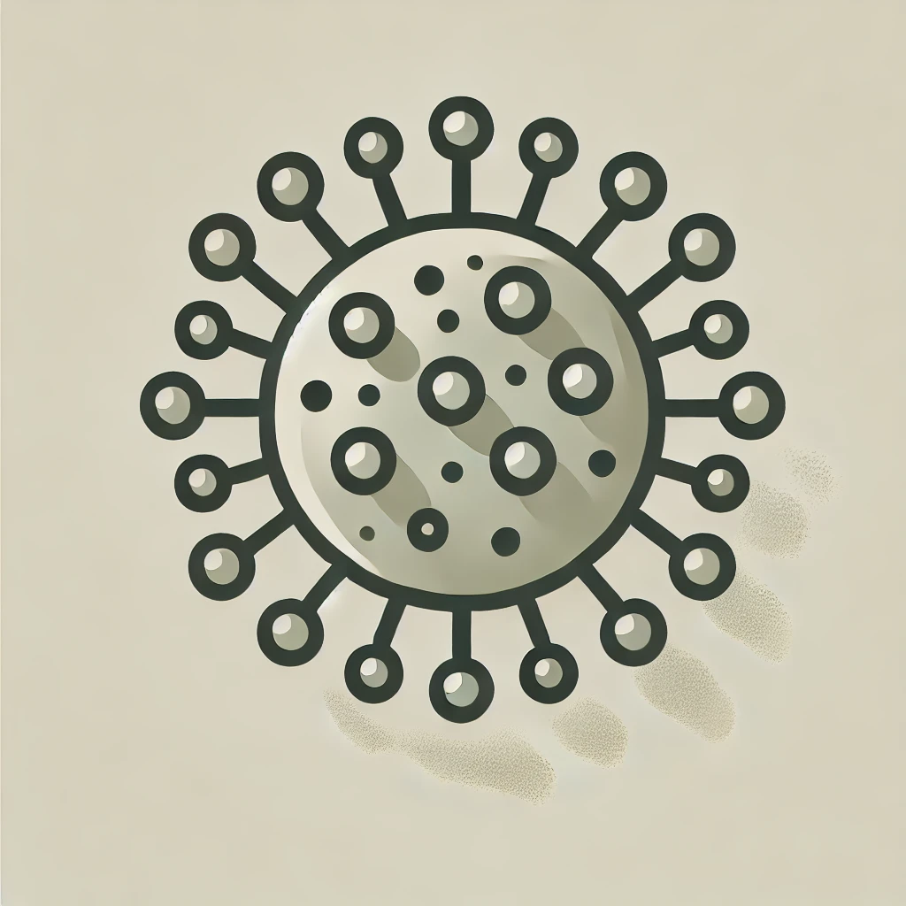

Zachariah Farahany
---

Hello! I’m Zachariah Farahany, an MS candidate in Applied Data Science at the University of Chicago, with a BS in Computer Science and Math from Marquette University. I specialize in data science, machine learning, and AI, and am driven by a passion for transforming complex data into actionable insights.

## Professional Experience

Currently, I’m an AI Solutions Consultant at Chartwell Insurance Services, where I implement retrieval-augmented generation (RAG) systems and advanced NLP models, significantly enhancing customer service operations. Previously, I was a Quantitative Analytics Intern at Wells Fargo in the AI & ML Center of Excellence, where I improved a generative AI chatbot with transformer-based classification and tackled bias mitigation.

With over 4 years of hands-on experience, I have developed expertise in areas ranging from statistical anomaly detection and healthcare analytics to large-scale ETL pipelines and deep learning for image generation.

## Key Projects

  

    <!--  -->
  

  
<a href="https://github.com/duncancalvert/SkySearch">SkySearch UAV</a>: Developed SkySearch, an advanced UAV computer vision system that leverages zero-shot learning and multimodal large language models to autonomously locate and navigate to virtually any object, achieving significant improvements in search accuracy and generalization over traditional UAV systems.

  

    <!--  -->
  

  
<a href="https://github.com/ZachFara/Oversampling-Techniques-for-Predicting-COVID-19-Patient-Length-of-Stay">COVID-Project</a>: Developed a model using Electronic Health Records (EHR) and oversampling techniques to predict COVID-19 severity, measured by patient length of stay, with an Artificial Neural Network optimized through Bayesian hyperparameter tuning.

## Skills and Technologies

- Programming & Tools: Python, SQL, Spark, Hadoop, Snowflake, Docker, AWS, GCP
- Machine Learning & AI: NLP, Generative AI, Diffusion Models, TensorFlow, PyTorch, MLFlow
- Data Science: Statistics, Data Visualization (Tableau/PowerBI), Big Data, A/B Testing
 
## My Information
LinkedIn: [Zachariah Farahany](https://www.linkedin.com/in/zach-farahany-3818aa1bb/)  
Email: zfarahany193@gmail.com

I’m always eager to connect with fellow data enthusiasts and collaborate on projects that push the boundaries of machine learning and data science. Check out my portfolio for more details on my work!

---
